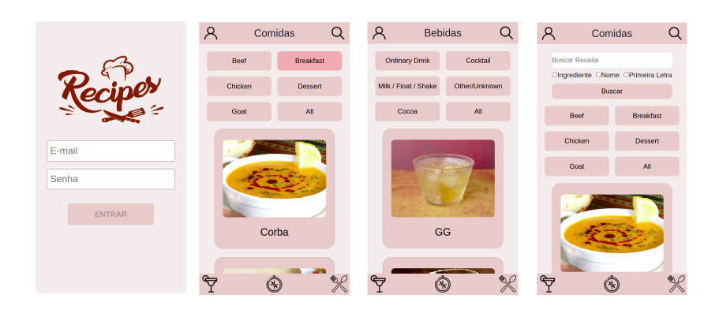
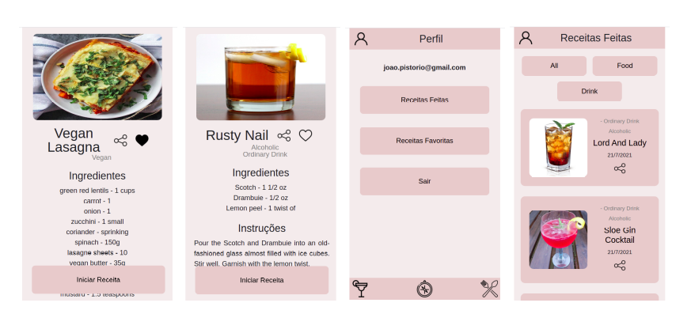
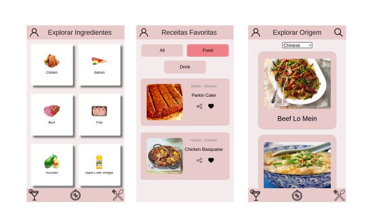

# Project App de Receitas
#### Este projeto faz parte da formação Full Stack da <a href="https://www.betrybe.com/">Trybe</a>.
---

## Introdução
 Desenvolvemos um app de receitas, e nele será possível ver, buscar, filtrar, favoritar e acompanhar o processo de preparação de receitas e drinks!
A base de dados serão 2 APIs distintas, uma para comidas e outra para bebidas.
O layout tem como foco dispositivos móveis, então todos os protótipos vão estar desenvolvidos em telas menores.

## APIs

### TheMealDB API

O [TheMealDB](https://www.themealdb.com/) é um banco de dados aberto, mantido pela comunidade, com receitas e ingredientes de todo o mundo.


### The CockTailDB API

[TheCocktailDB](https://www.thecocktaildb.com) Bem similar (inclusive mantida pela mesma entidade) a TheMealDB API, só que focado em bebidas.


# Habilidades

Nesse projeto, utilizamos

  - Redux para gerenciar estado
  - A biblioteca React-Redux
  - A biblioteca React-Router
  - BootStrap
  - Trello para gerenciamento das tarefas
  - Além de habilidades de soft skills para o trabalho em equipe

## Desenvolvimento






Para iniciar o desenvolvimento, é necessário clonar o repositório do GitHub, acessar o projeto Wallet e intalar as dependências:
```shell
cd "diretorio de sua preferencia"

git clone git@github.com:legalvao1/

cd 

npm install

